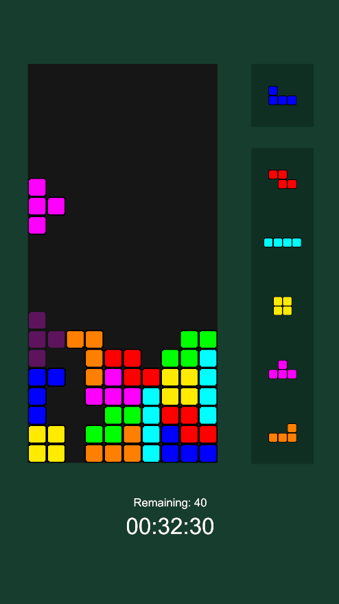
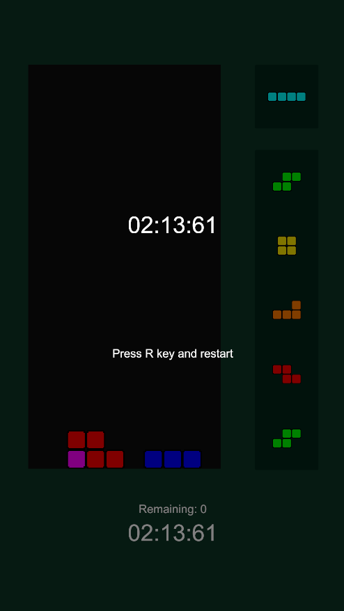
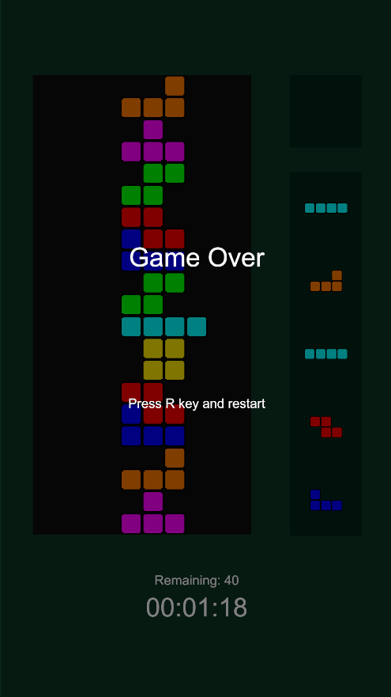

# Tetris_sprint
게임 개발 역량 강화를 위한 테트리스 미니 프로젝트입니다.
## 개발 환경
* Unity 6.3 (6000.3.6f1) 
* Visual Studio 2022
* Github Desktop
* Gemini 3 Pro
## 사용 리소스

## 개발 주요 포인트
### AI 사용
* Gemini 3.0 Pro를 사용하여 기능 구현 시간 단축
* 리팩토링, 버그 수정은 직접 시행
### 개발 가이드라인 준수
* 'The Tetris Company'의 테트리스 개발 가이드라인 최대한 준수
### 라이센스 및 출처 표기
* 크레딧 화면이 없으니 Readme.md에 제작자 요청을 준수하여 작성 
## 스크린샷

